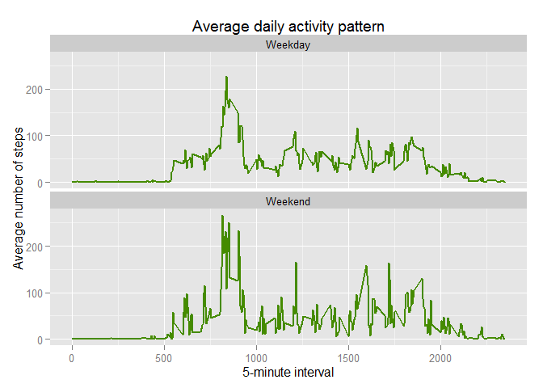

# Reproducible Research: Peer Assessment 1

## Loading and preprocessing the data


```r
library(data.table)
library(plyr)
library(dplyr)
library(ggplot2)
# Assigning the zip file of the dataset
downloadFile <- "./activity.zip"
activityFile <- "./activity.csv"

# Unzipping the file incase of non-existence, into the working directory.
if (!file.exists(activityFile)) {
  unzip(downloadFile, overwrite = T)
}

ActivityData <- read.csv(activityFile, sep = ",", na.strings = "NA")
# Conver to data table
ActivityData <- data.table(ActivityData)
```

## What is mean total number of steps taken per day?


```r
# split the database based on date and summarize the sum of total steps in each date.
Data.step <- ddply(ActivityData, .(date), summarize, TotalSteps = sum(steps, na.rm = TRUE))
# plot the histogram of the total number of steps
# setting the number of cells as 10
hist(Data.step$TotalSteps, breaks = 10,
     xlab = "Total Number of Steps", main = "Histogram of Number of Steps per day")
```

 

```r
# Calculate and report the mean and median of the total number of steps taken per day
# using knitr::kable function for table to be displayed with additional formatting
knitr::kable(summarize(Data.step, medianofSteps= median(TotalSteps),
          meanofSteps= mean(TotalSteps)), row.names = FALSE, align = 'c',
          col.names = c("Median of the total number of steps","Mean of the total number of steps"))
```


 Median of the total number of steps    Mean of the total number of steps 
-------------------------------------  -----------------------------------
                10395                                9354.23              


## What is the average daily activity pattern?

```r
# split the database based on interval and summarize the mean of total steps in each interval.
Data.mean.step <- ddply(ActivityData, .(interval), summarize, MeanSteps = mean(steps, na.rm = TRUE))
# plot the average number of steps across all days, per inteval
with(Data.mean.step, plot(interval,MeanSteps, type = "l", lwd=2.5, pch = 18, col = "blue",
     xlab = "5-minute interval", ylab = "Average number of steps", main = "Average daily activity pattern per interval"))
```

 

```r
# Which 5-minute interval contains the maximum average number of steps 
knitr::kable(summarize(Data.mean.step, maxInd= interval[which.max(MeanSteps)], 
          maxStep = max(MeanSteps)), row.names = FALSE, align = 'c',
          col.names = c("5-minute interval index" ,"maximum average number of steps"))
```


 5-minute interval index    maximum average number of steps 
-------------------------  ---------------------------------
           835                         206.1698             

- The interval 835 has the maximum average value of steps (206.1698).

## Imputing missing values

```r
# calculating the total number of NA rows in the database
sum(is.na(ActivityData$steps))
```

[1] 2304

- Total number of rows with NA's is 2304.


```r
#  strategy for filling in all of the missing values in the dataset with the mean of that interval.
NewData <- ActivityData
# extracting the interval of NA values
NAinterval <- NewData[is.na(ActivityData$steps),interval]
# fiding the index of the NA interval
Ind <- match(NAinterval, Data.mean.step$interval)
# assigning the mean of the corresponding interval for the missing value indexes
# also rounding the mean of intervals
NewData[is.na(ActivityData$steps),"steps"] <- round(Data.mean.step[Ind,"MeanSteps"])
```

```
## Warning in `[<-.data.table`(`*tmp*`, is.na(ActivityData$steps), "steps", :
## Coerced 'double' RHS to 'integer' to match the column's type; may have
## truncated precision. Either change the target column to 'double' first (by
## creating a new 'double' vector length 17568 (nrows of entire table) and
## assign that; i.e. 'replace' column), or coerce RHS to 'integer' (e.g. 1L,
## NA_[real|integer]_, as.*, etc) to make your intent clear and for speed. Or,
## set the column type correctly up front when you create the table and stick
## to it, please.
```

```r
# split the database based on date and summarize the sum of total steps in each date.
NewData.step <- ddply(NewData, .(date), summarize, TotalSteps = sum(steps))
# plot the histogram of the total number of steps
# setting the number of cells as 10
hist(NewData.step$TotalSteps, breaks = 10,
     xlab = "Total Number of Steps", main = "Histogram of Number of Steps per day (imputed)")
```

 

```r
# Calculate and report the mean and median of the total number of steps taken per day
# using knitr::kable function for table to be displayed with additional formatting
knitr::kable(summarize(NewData.step, medianofSteps= median(TotalSteps),
          meanofSteps= mean(TotalSteps)), row.names = FALSE, align = 'c',
          col.names = c("median of the total number of steps","mean of the total number of steps"))
```


 median of the total number of steps    mean of the total number of steps 
-------------------------------------  -----------------------------------
                10762                               10765.64              

- Mean and meadian values in the imputed NA's are become closer and the histogram shifts towards a normal distribution as it supposed to be based on the Central Limit Theorem (CLT).

## Are there differences in activity patterns between weekdays and weekends?


```r
# Create a new factor variable in the dataset with two levels 
# "weekday" and "weekend" indicating whether a given date is a weekday or weekend day.
NewData$DayCategory <- ifelse(weekdays(as.Date(NewData.step$date)) %in% c("Saturday","Sunday"),
                              "Weekend","Weekday")

# split the database based on interval and day category and summarize the mean of total steps in each interval.
NewData.mean.step <- ddply(NewData, .(interval,DayCategory), summarize, MeanSteps = mean(steps))

ggplot(NewData.mean.step, aes(interval,MeanSteps))+geom_line(color="chartreuse4", lwd=1)+
    facet_wrap(~DayCategory, ncol=1) +
    labs(x="5-minute interval", y ="Average number of steps", title="Average daily activity pattern")
```

 
